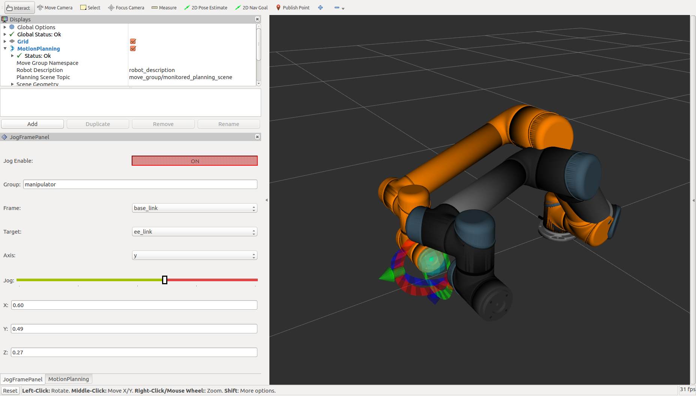
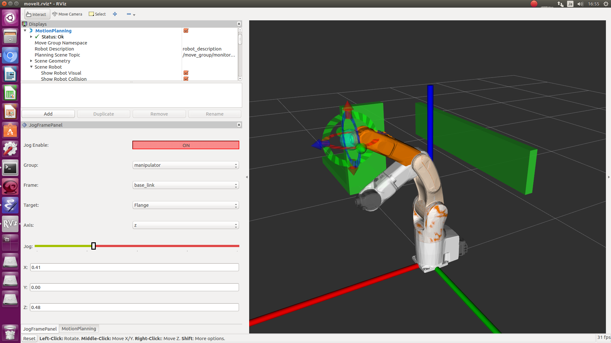
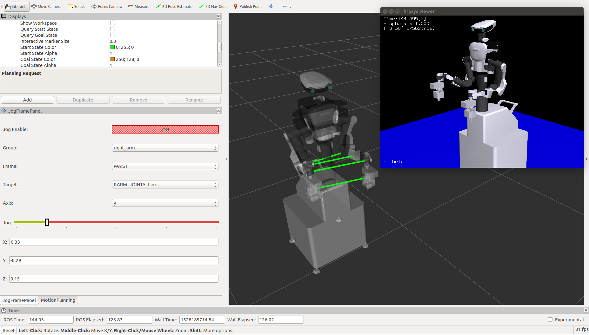
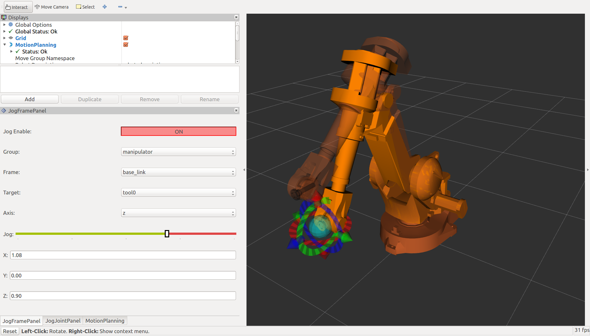
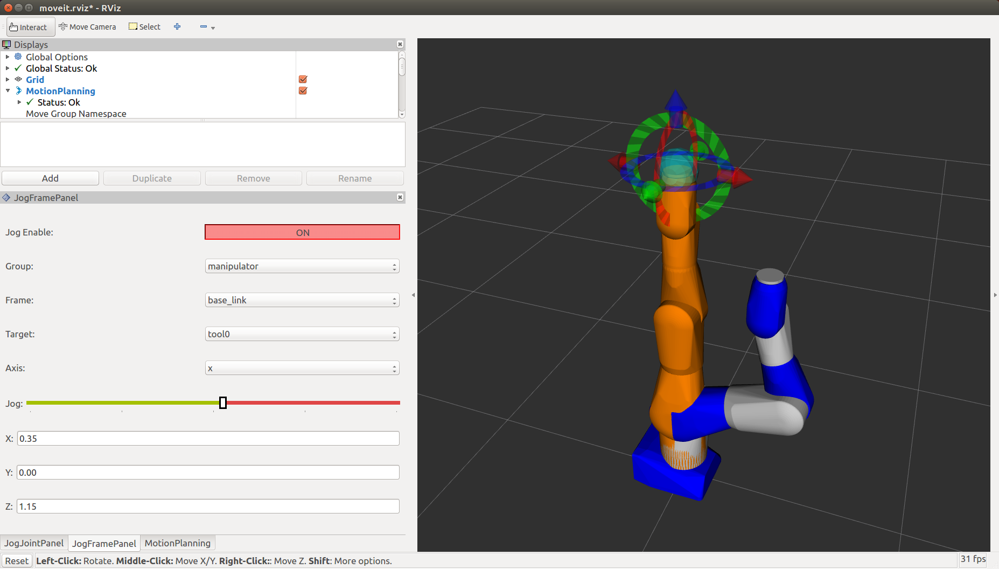
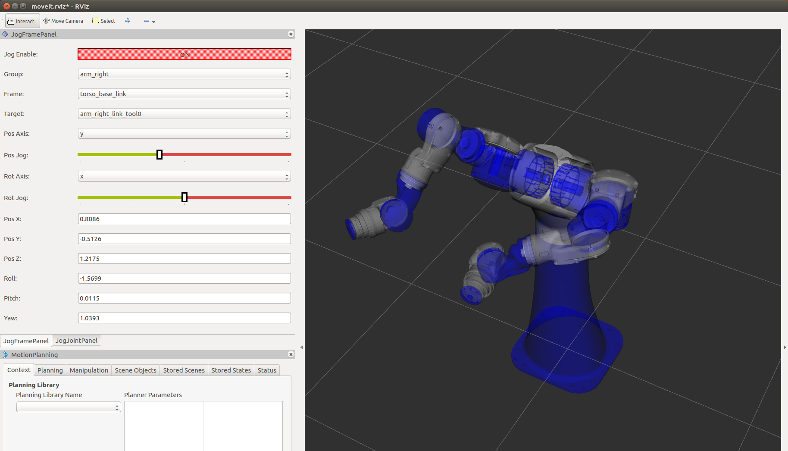
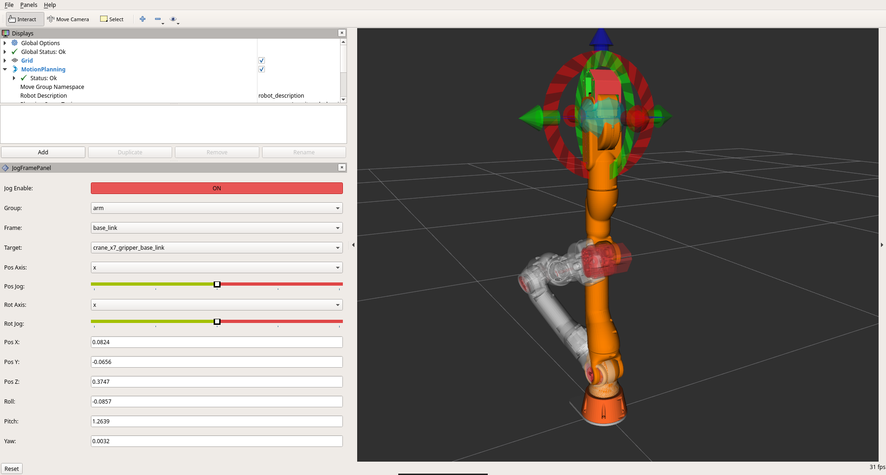

# Overview [](https://travis-ci.org/tork-a/jog_control)

[ROS](http://www.ros.org) and [MoveIt!](http://moveit.ros.org) are
very powerful tools for industrial manipulators. Many people use ROS
packages to control their own industrial manipulators. You can see
many manipulators are available on
[ROS-Industrial project](https://rosindustrial.org).

However, ROS has several missing features for industrial usage. The
one is "jogging". Jogging is to make the actual robot move by small
amount of distance. We can repeat jogging to adjust the robot to teach
target position and posture.

Most commercial industrial robots have their own jog control in the
teaching pendants. Some ROS oriented robot has no teaching pendant and
no jog control, so it can be a big barrier to use ROS for industrial
usage.

This `jog_control` repositry has packages for jog control
(reasonably). You can jog your robot by rviz jog panel, joypads,
keyboards, and teaching pendants using these packages.

# Quick start

You can see the idea of jog_control package by demo in `jog_launch`
package. It uses simulation and MoveIt!. Some robots are from
[ROS-Industrial repositry](https://github.com/ros-industrial), which
you need to build from source code.

# How to install

## Install from binary (in the future)

This package is not released yet. When it is released, you can install
by apt command.

```
$ apt install ros-kinetic-jog-control
```

## Install from source

```
$ source /opt/ros/kinetic/setup.bash
$ mkdir -p ws/src
$ cd ws
$ wstool init src
$ wstool set -t src jog_control --git http://github.com/tork-a/jog_control
$ wstool update -t src
$ rosdep install -r --from-path src --ignore-src
$ catkin build
$ source devel/setup.bash
```

## UR3 and UR5(Gazebo and MoveIt!)



Launch simulation and MoveIt! (Replace ur5 to ur3 if you need)

```
$ roslaunch ur_gazebo ur5_joint_limited.launch
$ roslaunch ur5_moveit_config ur5_moveit_planning_execution.launch sim:=true
$ roslaunch ur5_moveit_config moveit_rviz.launch config:=true
```

And launch jog nodes.

```
$ roslaunch jog_launch ur5.launch
```

## UR5(fake_joint)

You can use `fake_joint` package to use the perfect joint
controller. Just launch:

```
$ roslaunch jog_launch ur5.launch use_fake_joint:=true use_moveit:=true use_rviz:=true
```

## TRA1 (Simulation mode)


Launch simulation and MoveIt!

```
$ roslaunch tra1_bringup tra1_bringup.launch simulation:=true
$ roslaunch tra1_bringup tra1_moveit.launch 
```

And launch jog nodes.

```
$ roslaunch jog_launch tra1.launch
```

## TRA1 (fake_joint)

You can use `fake_joint` package to use the perfect joint
controller. Just launch:

```
$ roslaunch jog_launch tra1.launch use_fake_joint:=true use_moveit:=true use_rviz:=true
```


## Denso VS060



Launch simulation and MoveIt!

```
$ roslaunch denso_launch denso_vs060_moveit_demo_simulation.launch 
```

And launch jog nodes.

```
$ roslaunch jog_launch vs060.launch
```

## NEXTAGE Open (OpenRTM simulation)



Launch simulation and MoveIt!

```
$ rtmlaunch nextage_ros_bridge nextage_ros_bridge_simulation.launch
$ roslaunch nextage_moveit_config moveit_planning_execution.launch 
```

And launch jog nodes.

```
$ roslaunch jog_launch nextage.launch
```

## NEXTAGE Open (fake_joint)

You can use `fake_joint` package to use the perfect joint
controller. Just launch:

```
$ roslaunch jog_launch nextage.launch use_fake_joint:=true use_moveit:=true
```

## ABB IRB2400



(CAUTION: The model of this robot is a bit strange in joint limits.
The jog may not move because of joints flipping.)

Launch simulation and MoveIt!

```
$ roslaunch abb_irb2400_moveit_config moveit_planning_execution.launch 
```

And launch jog nodes.

```
$ roslaunch jog_launch abb_irb2400.launch 
```

## MOTOMAN SIA20D



Launch simulation and MoveIt!

```
$ roslaunch motoman_sia20d_moveit_config moveit_planning_execution.launch sim:=true
```

And launch jog nodes.

```
$ roslaunch jog_launch motoman_sia20d.launch
```

## MOTOMAN SDA10F



This is another dual arm robot by Yaskawa MOTOMAN.

Launch simulation and MoveIt!

```
$ roslaunch motoman_sda10f_moveit_config moveit_planning_execution.launch sim:=true
```

And launch jog nodes.

```
$ roslaunch jog_launch motoman_sda10f.launch 
```

## CRANE-X7



The CRANE-X7 package is [here](https://github.com/rt-net/crane_x7_ros).

Launch simulation and MoveIt!

```
$ roslaunch crane_x7_gazebo crane_x7_with_table.launch
```

And launch jog nodes.

```
$ roslaunch jog_launch crane_x7.launch
```


## rviz JogFramePanel Pugin

You ca add new panel JogFramePanel in rviz. 

## Joypad control

You can also use a joypad. Please consult
[jog_controller/README.md](jog_controller/README.md)

## SpaceMouse control

You can also use a SpaceMouse. Please consult
[jog_controller/README.md](jog_controller/README.md)

## Teaching pendant

You can also use a teaching pendant.
TBA.

# Packages

## [jog_msgs](jog_msgs/README.md)

`jog_msgs` is a ROS message package for jog control.

## [jog_controller](jog_controller/README.md)

`jog_controller` contains ROS nodes for jog control.

# CAUTION

- Please take extra care when you use this package with real robot, seriously!
- You need to launch MoveIt! before start jog_controllers
  - https://github.com/tork-a/jog_control/issues/18

# TODO

- Wiser target picking (group name, target link, etc)
- Marker visualization for target link and base link
- Dynamic reconfigure for jog_controller
