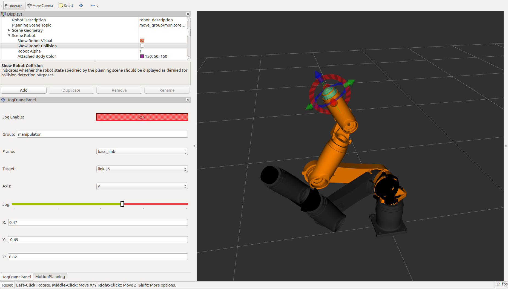
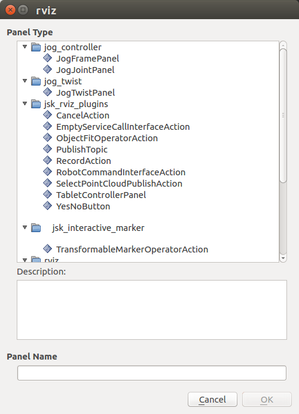

# jog_controller

This package contains controller nodes for jog control. For now, it
has two indivisual nodes, 'jog_joint_node' and 'frame_joint_node'.

Both nodes depend on MoveIt!, so you should make sure MoveIt! is
available for your robot in advance.

Both nodes use `PositionController` which is provided by
`ros_controllers/joint_trajectory_controller` package.

## jog_joint_node

'jog_joint_node' is for joint jogging. Joint jogging is to adjust the
target joint angle by small amount of displacement. You can send
[`JogJoint` message](https://github.com/tork-a/jog_control/blob/master/jog_msgs/msg/JogJoint.msg)
to command the target joint and differential angle (delta).

### Subscribed topic

- joint_states (sensor_msgs/JointState)

  Current joint states (angle, velocity, acceleration)

- jog_joint (jog_msgs/JogJoint)
  
  Joint jog command

### Required service / action

This package uses position_cotnroller to control joint angles. It read
the controller configuration form MoveIt! parameter
(move_group/controller_list), so MoveIt! should be available before
this node starting.
  
- follow_joint_trajecotry/goal (control_msgs/FollowJointTrajectoryAction)

  The goal joint angle to control

## jog_frame_node

'jog_frame_node' is for frame jogging. Frame jogging is to adjust the
target frame position and orientation by small amount of
displacement. You can send
[`JogFrame` message](https://github.com/tork-a/jog_control/blob/master/jog_msgs/msg/JogFrame.msg)
to command the target frame and differential displacement of position
and orientation.

### Subscribed topic

- joint_states (sensor_msgs/JointState)

  Current joint states (angle, velocity, acceleration)

- jog_frame (jog_msgs/JogFrame)
  
  Jog command for target frame

### Required service / action

This package depends on move_group of MoveIt! to compute
kinematics. 

- /compute_ik
  
  Service to get inverse kinematics by MoveIt!

- /compute_fk
  
  Service to get forward kinematics by MoveIt!

This package uses position_cotnroller to control joint angles. It read
the controller configuration form MoveIt! parameter
(move_group/controller_list), so MoveIt! should be available before this
node starting.
  
- follow_joint_trajecotry/goal (control_msgs/FollowJointTrajectoryAction)

  The goal joint angle to control

## Creating setting files for your own robot

You need a launch file and a configuration file your robot to use
jog_controller. Let me show you the setting using 'tra1' robot as a
example in the following description. You can install tra1 package as:

```
$ apt install ros-knetic-tra1-bringup
```

### Create your own package

You are recommended to create your own package to store the
configuration file.

```
$ catkin_create_pkg tra1_jog_config jog_controller tra1_bringup
```

### Checking your robot configuration

jog_controller depends on MoveIt!, thus your robot need to work with
MoveIt! already. Please check you have your moveit_config package such
as 'tra1_moveit_config'.

```
$ rospack find tra1_moveit_config
$ roscd tra1_moveit_config/config
```

Then you can check the Moveit! config file. First check the
`tra1_controllers.yaml` to see the joint list.

```
$ cat tra1_controllers.yaml
controller_manager_ns: controller_manager
controller_list:
  - name: position_trajectory_controller
    action_ns: follow_joint_trajectory
    type: FollowJointTrajectory
    default: true
    joints:
      - joint1
      - joint2
      - joint3
      - joint4
      - joint5
      - joint6
```

It says the list of the joint in `joints:` field. Please note that you
may have two or more controllers in your robot and the joints are
separated in each controllers.

Then you can check the tra1.srdf. In this file, you can see the
group name, and target link which are used in MoveIt!.

```
$ cat tra1.srdf
...
<group name="manipulator">
    <chain base_link="base_link" tip_link="link_j6" />
</group>
...
```

It says it contains the group named 'manipulator' and target link is
named 'link_j6'. Please notice you may have multiple groups in dual
arm robot.

### Creating config YAML file

Create tra1_jog_config/config/tra1_jog.yaml file to set the parameters for each
node.

```
jog_joint_node:
  joint_names:
    - joint1
    - joint2
    - joint3
    - joint4
    - joint5
    - joint6

jog_frame_node:
  group_names:
    - manipulator
  link_names:
    - link_j6
```

'joint_names:' should contain the joint names which you have seen in
the MoveIt! config file. Only joints in this list are used in the jog
control and you don't need to specify unused joints. You cannot
specify any joints not in the MoveIt! config file.

'group_names' should be a list of group name which you have seen in
the MoveIt! config file. And 'link_names:' is a list of target frame
which you want to control with jog_frame_node.

### Creating launch file

Create the launch file as tra1_jog_config/launch/tra1_jog.launch .

```
<launch>
  <arg name="use_joy" default="false"/>

  <!-- Jog controllers -->
  <rosparam command="load"
	    file="$(find tra1_jog_config)/config/tra1_jog.yaml"/>
  <node name="jog_joint_node" pkg="jog_controller" type="jog_joint_node"/>
  <node name="jog_frame_node" pkg="jog_controller" type="jog_frame_node"/>

  <!-- Launch joypad -->
  <include if="$(arg use_joy)" file="$(find jog_controller)/launch/joypad.launch">
    <arg name="group_name" value="manipulator"/>
    <arg name="frame_id" value="base_link"/>
    <arg name="link_name" value="link_j6"/>
  </include>
  
</launch>
```

If you want to use joypad to jog, you can set `use_jog` argument
true. Caution: joypad support is experimental.

## Check the jog control with your robot

### Check with rviz jog panel plugin

Fisrtly you should bring your own robot system and MoveIt!. It depends
on how you created the system for your robot. With tra1, we can start
the controller in simulation (loopback) mode as:

```
$ roslaunch tra1_bringup tra1_bringup.launch simulation:=true
$ roslaunch tra1_bringup tra1_moveit.launch 
```

Now you can see the rviz window for MoveIt!.



### rviz jog control panel plugin

From rviz menu, you can choose "Panels" -> "Add New Panel". You can
see JogJointPanel and JogFramePanel in the list. Choose it and push
"OK" button, and you can add the panels on the left side of you rviz
window.



Please notice you can drag the panels to adjust the size and position
in the rviz pane.

### joypad

`joypad.launch` is the launch file to bringup joypad driver (joy node)
and the converter node (joy_to_jog_frame.py). This launch file has the
following arguments.

- `joy_dev` (default: /dev/input/js0)

  The device file name of the joypad. Specify the defice file name of
  your joypad here. You can check your device by `ls /dev/input`
  command.

- `joy_config` (default: xbox_wireless)

  Configure file to setup button assignments. You can find an example
  in `config/xbox_wireless.config.yaml`. Notice you need to modify the
  config file to fit your joypad device.

- `group_name` (default: manipulator)

  This is the MoveIt! group name to jog. It needs to be identical to
  the group name you want to use.

- `link_name` (default: tool0)

  This is the link_name to jog. You need to specify a valid frame name
  in the group.
  
- `frame_id`

  Reference frame for frame jogging. You can specify valid frame name
  such as `base_link`, `tool0` and so on.
  
Please check your joypad is available by launching joypad.launch.

```
$ roslaunch jog_controller joypad.launch
```

If you got error like:

```
[ERROR] [1533283649.439653297]: Couldn't open joystick /dev/input/js0. Will retry every second.
```

then check the joypad connection and you can see device file in
`/dev/input/`. Please note some joypad need to be powered on. (XBox
wireless has a silver power button shaped round 'X' in front of the
joypad.)

If you have no error, please check if the jog_frame topic is
published.

```
$ rostopic echo /jog_frame
```

You need to push 'Enable' button which is set by the `enable_button`
parameter in the config file. You can see message like:

```
header: 
  seq: 751
  stamp: 
    secs: 1531982605
    nsecs: 330952195
  frame_id: "base_link"
group_name: "manipulator"
link_name: "tool0"
linear_delta: 
  x: 0.0
  y: -0.0
  z: -0.0
angular_delta: 
  x: 0.0
  y: 0.0
  z: 0.0
avoid_collisions: True
```

and check your sticks produce desired message.

### SpaceMouse

`twist.launch` is the launch file to bringup spacenav_node
and the converter node (twist_to_jog_frame.py). This launch file has the
following arguments.

- `joy_config` (default: spacemouse_twist)

  Use the configuration file to setup the agruments. You can find an example in `config/spacemouse_twist.config.yaml`
  The config file has the following arguments:
  
  | Argument | Default | Details|
  |----------|---------|--------|
  | `scale_linear` | 0.005 | This is the linear speed multiplier |
  | `scale_angular` | 0.05| This is the angular speed multiplier |
  | `dominant_mode` | True | When the dominant mode is enabled, only the biggest absolute value is kept. |
  | `axes_remap` | True | Enable if a rotation matrix is required. |
  | `rotation_matrix` | | The rotation matrix required to transform the space mouse input from it's coordinate system to the target coordinate system. |

- `group_name` (default: manipulator)

  This is the MoveIt! group name to jog. It needs to be identical to
  the group name you want to use.

- `link_name` (default: tool0)

  This is the link_name to jog. You need to specify a valid frame name
  in the group.
  
- `frame_id`

  Reference frame for frame jogging. You can specify valid frame name
  such as `base_link`, `tool0` and so on.
  
Please check your spacemouse is available by launching twist.launch.

```
$ roslaunch jog_controller twist.launch
```

If you have no error, please check if the jog_frame topic is
published.

```
$ rostopic echo /jog_frame
```

You can see message like:

```
header: 
  seq: 751
  stamp: 
    secs: 1531982605
    nsecs: 330952195
  frame_id: "base_link"
group_name: "manipulator"
link_name: "tool0"
linear_delta: 
  x: 0.0
  y: -0.0
  z: -0.0
angular_delta: 
  x: 0.0
  y: 0.0
  z: 0.0
avoid_collisions: True
```
and check your /spacenav/twist produce desired message.
